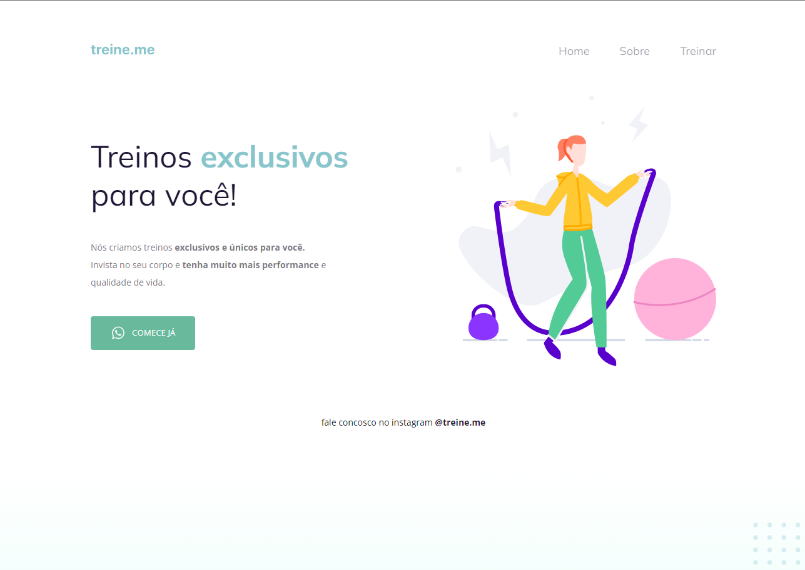

# Explorer Project 2

## Overview

Welcome to `#explorer-project-2`, a project focused on implementing a UI design from Figma using semantic HTML tags, CSS Flexbox, and ensuring accessibility. This project is an excellent opportunity for learners to deepen their understanding of modern web development practices.

## Project Structure

The project consists of the following files and folders:

- `index.html` - The main HTML file containing the structure of the web page.
- `style.css` - The CSS file that styles the web page.
- `images/` - Folder containing images used in the project, including `project.png` for a preview.

## Design

The UI design is based on a Figma project. You can view the design [here](https://www.figma.com/file/9e8oZ7kkjIt5rkNgz9MPtk/Explorer---Projeto-02/duplicate).

## Learning Objectives

- **Semantic HTML**: Understanding and implementing semantic HTML tags to improve the structure and accessibility of the web content.
- **Accessibility**: Ensuring that the website is accessible to all users, including those with disabilities.
- **CSS Flexbox**: Utilizing CSS Flexbox to create a responsive layout.
- **Pseudo-classes**: Learning and applying CSS pseudo-classes to enhance the interactivity of web elements.

## How to Use

1. Clone the repository to your local machine.
2. Open `index.html` in a web browser to view the project.
3. Explore the code in `index.html` and `style.css` to understand the implementation.

## Contributing

Feel free to fork this project and submit pull requests. Any contributions you make are greatly appreciated.

## License

This project is open source and available under the [MIT License](LICENSE.md).

## Acknowledgements

- Design inspiration from [Figma Design](https://www.figma.com/file/9e8oZ7kkjIt5rkNgz9MPtk/Explorer---Projeto-02/duplicate).
- Thanks to all contributors and reviewers.
